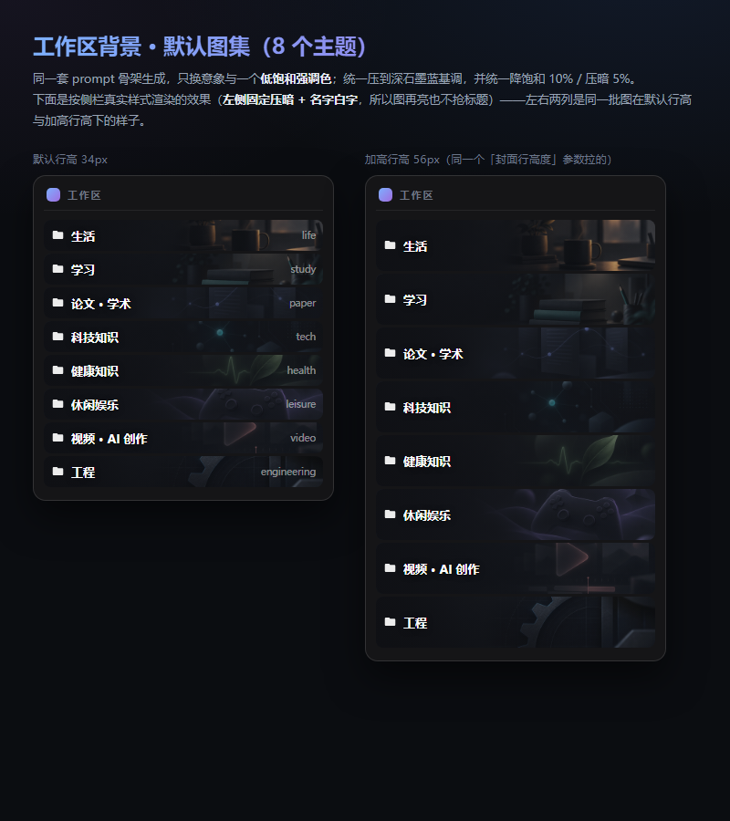
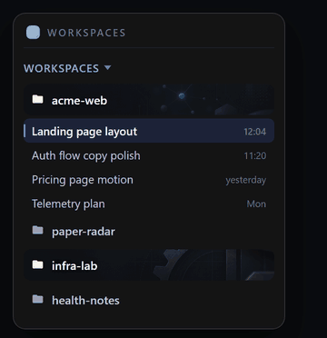
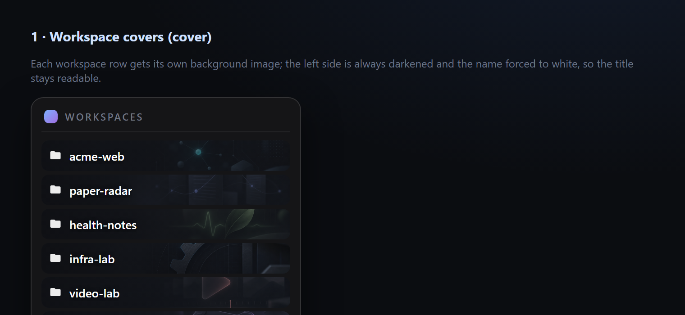
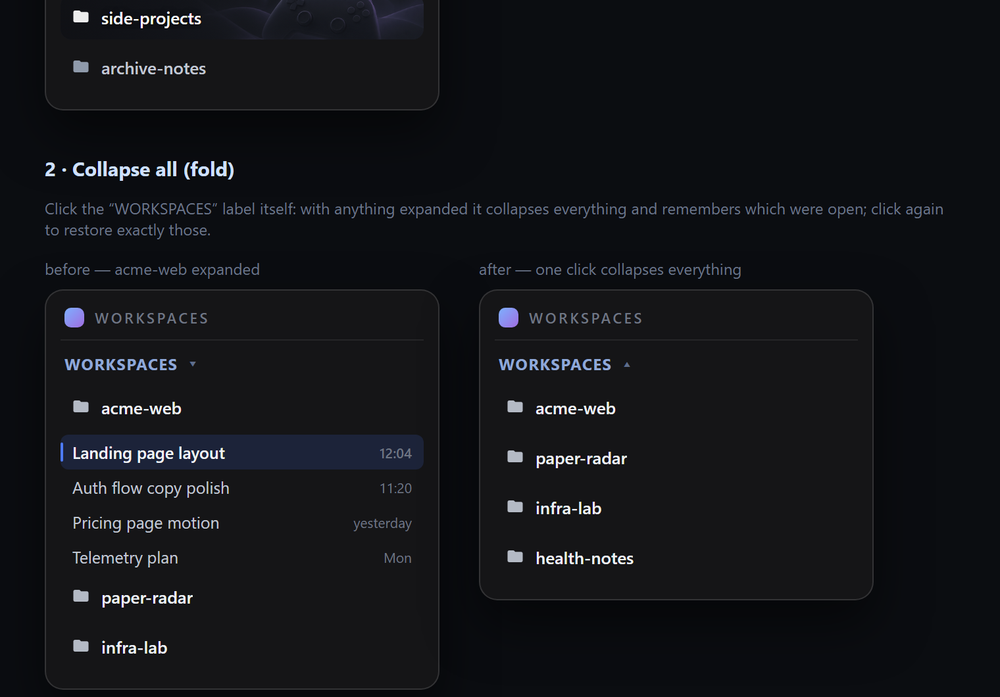
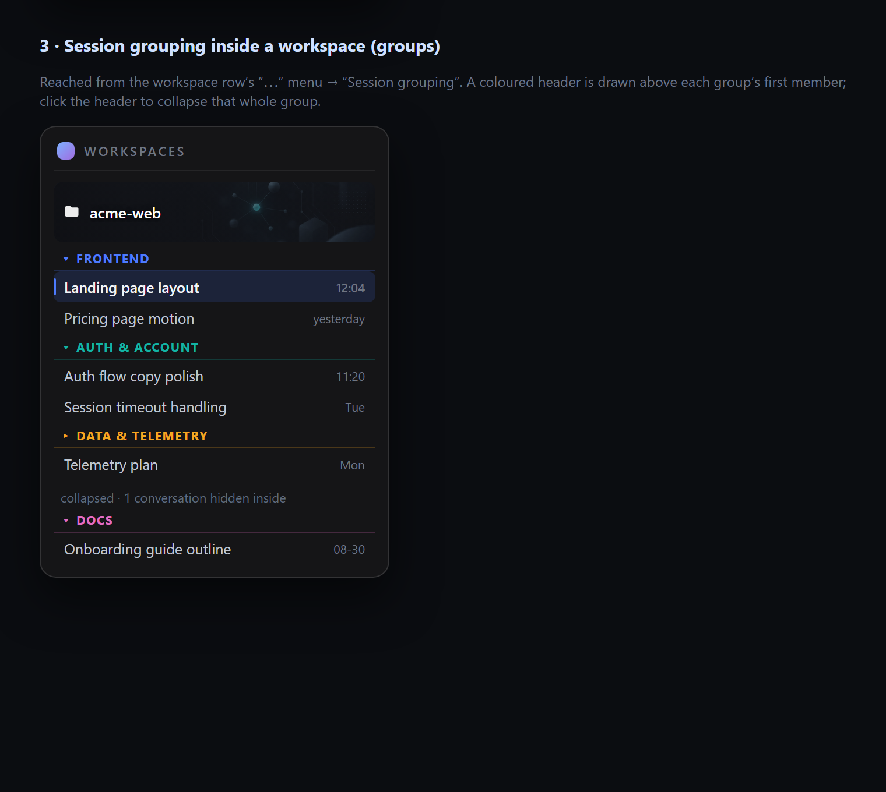

# dsh-workspace-tools

> 给 [DSH Web](https://github.com/deepseek-ai) 侧栏「工作区」这一层做的一体化增强插件：
> **工作区背景图** + **一键折叠全部** + **工作区内会话分组**。三块功能各带开关，可在 `设置 →「工作区」` 里即时开合（不用重启）。





<sub>English TL;DR — A single DSH Web client plugin that upgrades the sidebar's *workspace* layer: per-workspace cover images (with crop/darkening and auto contrast fitting), one-click collapse-all, and nested session grouping inside a workspace. Each feature has its own toggle in Settings → 工作区, applied instantly. Pure additive DOM decoration — it never inserts or removes React-managed nodes.</sub>

---

> 说明：本文档中的界面截图使用**虚拟示例数据**（`acme-web`、`paper-radar`、`infra-lab` 等），不含任何真实工作区、路径或个人信息。

## 功能

### 1. 工作区背景（cover）

给每个工作区配一张**行背景图**，一眼认图不认字。

- 上传任意图片，或从**内置的 8 张默认图集**里挑（见下）
- 编辑器支持：缩放、上下/左右位置（滑块 + 方向键，Shift 加速 5×）、亮度、饱和度、对比度、文字区柔化（景深）、文字区压暗蒙版、蒙版收尾、整体模糊
- **自动适配**：按 WCAG 二分搜索蒙版强度，把标题对比度顶到 7:1 以上 —— 图再亮也抢不走工作区名
- 调参时侧栏那一行**实时跟着变**（不必先保存）
- 「封面行高度」是全局统一参数（28–120px），文字始终上下居中



### 2. 一键折叠全部（fold）

把侧栏「工作区」小标题本身变成按钮：

- 有工作区展开时点一下 → **全部折叠**，只剩工作区名，并记住折叠前展开的是哪几个
- 全折叠后再点一下 → **精确恢复**那几个（不是粗暴全展开）
- 带 ▾/▴ 状态指示、hover 高亮、`title` 提示，键盘 Enter / 空格同样可用



### 3. 工作区内会话分组（groups）

一个工作区下常有十几个方向各异的会话，平铺一级很难翻。这个功能在工作区下面**再分一层**：

- 入口在**工作区行的「⋯」菜单**里 →「会话分组」（该菜单项原本是一个会崩的第三方按钮，本插件把它就地改造并接管了点击）
- 管理面板可建组（自动配色）、删组、折叠，并逐个把会话归到组里
- 侧栏里在每组第一个成员上方画一条彩色分组标头（▾/▸），**点标头即整组折叠**；会话行保持原生外观



---

## 安装

> 前置：DSH Web（`dsh web`）已经在跑，profile 目录为 `~/.dsh/profiles/<profile>/`（默认 `web`）。

### 方式 A：脚本（推荐）

```bash
git clone <this-repo> dsh-workspace-tools
cd dsh-workspace-tools
node install.mjs            # 默认装到 profile "web"
node install.mjs myprofile  # 或指定 profile 名
```

脚本会：把插件复制到 `packages/` 与 `node_modules/`、在 profile 的 `package.json` 里登记 `dependencies` 与 `dsh.profile.bundles`（**先自动备份**）、全程用 UTF-8 无 BOM 写入并当场校验。

### 方式 B：手动

1. 把本目录（含 `assets/`）复制成两份：
   - `~/.dsh/profiles/web/packages/dsh-workspace-tools/`
   - `~/.dsh/profiles/web/node_modules/dsh-workspace-tools/`
2. 编辑 `~/.dsh/profiles/web/package.json`：
   - `dependencies` 加一行 `"dsh-workspace-tools": "file:packages\\dsh-workspace-tools"`
   - `dsh.profile.bundles` 数组加一项 `"dsh-workspace-tools"`

### 生效

**重启 dsh web**（bundles 只在启动时读取；热加载不会重新读 bundle 列表）。

## 使用

1. 打开 `设置 →「工作区」`，三个开关按需开合（**即时生效**）
2. 封面：`工作区背景` 打开后，在下面的工作区列表里点某个工作区的「设置封面」→ 编辑器**就地展开在该行下方** → 选图（默认图集或自传）→ 调参 → 保存
3. 折叠：直接点侧栏的「工作区」字样
4. 分组：在工作区行右侧「⋯」菜单里点「会话分组」

## 数据与卸载

| 内容 | 位置 |
|---|---|
| 封面成品图 / 原图 / 索引 | `~/.dsh/storages/workspace-covers/`（`<key>.png`、`<key>-src.png`、`index.json`、`global.json`） |
| 三个开关状态 | 浏览器 `localStorage['dsh.workspace.tools.v1']` |
| 会话分组数据 | 浏览器 `localStorage['dsh.sidebar.groups.v1']` |

> 插件的 HTTP 路由只接受来自**本机来源**（`127.0.0.1` / `localhost` / `::1`，不限端口）的请求，拒绝跨站请求；所有数据都留在本机，不向任何第三方发送。

**卸载**：删掉 `packages/` 与 `node_modules/` 两个目录 + `package.json` 里那两行，重启 dsh web 即可（存储目录可一并删除，不影响其他插件）。

## 内置图集


8 张主题背景图（生活 / 学习 / 论文·学术 / 科技知识 / 健康知识 / 休闲娱乐 / 视频·AI 创作 / 工程），由 `gpt-image-2` 按**同一套 prompt 骨架**生成：深石墨蓝底 `#1a1d24` + 单个低饱和强调色 + 左侧三分之一留空给标题 + 主体略偏右 + 无文字无人脸；出图后统一裁 3:1 并做**降饱和 10% / 压暗 5%**，所以 8 张放一起不会互相打架。

想自己补图请沿用这个口径（`assets/presets/*.png`，768×256，3:1）。

## 已知限制

- **依赖 DSH 前端的内部结构**：类名只按后缀匹配（`[class*="projectRow"]`、`[class*="sessionRow"]`、`[class*="_sectionLabel"]`…），因此构建哈希变化不受影响；但**若 DSH 改了 DOM 层级或 slot 名，需要跟着适配**。开发于 `dsh 0.1.5-rc.2`。
- **会话分组用纯样式重排**：插件把会话列表容器设为 `flex-column`、给每个会话行外层的 wrapper 设 `order`，从而把同组会话**聚到一起**——**不移动任何 React 节点**（移动节点会让 React 下次 diff 时崩，那是本插件刻意避开的路）。唯一副作用：DSH 自带的会话拖拽排序仍按 DOM 顺序记录，所以视觉顺序与拖拽手感可能不完全一致。只有一个成员的分组折叠后，标头那一行仍会显示。
- 分组按**会话标题文本**记账，会话改名后需要重新归组。
- 三块功能都是纯前端装饰：**只加 class / data 属性 / 内联 CSS 变量，从不增删 React 管理的节点**。

## License

代码 MIT（见 `LICENSE`）。内置图集为 AI 生成素材，随仓库以同一许可提供。
